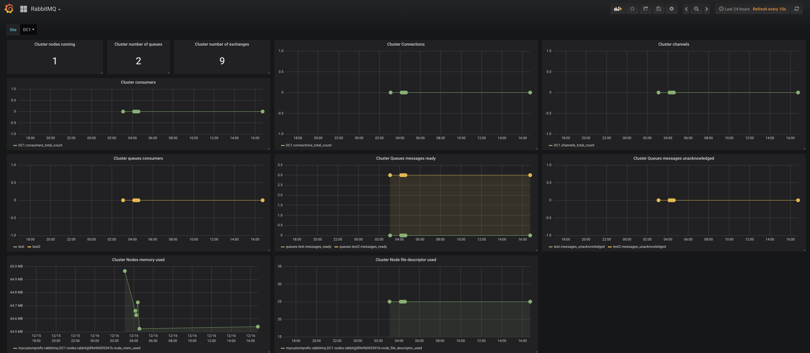

# rabbitmq-metrics-to-graphite
Read datas from RABBITMQ and send metrics to Graphite

## How to install

### Using ``pip``

```:sh
pip install rabbitmq-metrics-to-graphite
```
### From git rpo

```:sh
git clone https://github.com/orachide/rabbitmq-metrics-to-graphite.git
cd rabbitmq-metrics-to-graphite
python setup.py build
python setup.py install
```


## Configuration

Example configuration file:

```json
{
    "graphite_servers": [{
        "host": "localhost",
        "port": 2003,
        "prefix": "mycustomprefix.rabbitmq"
    }],
    "rabbitmq_clusters": [{
            "cluster_name": "DC1",
            "host": "localhost",
            "port": 15672,
            "username": "guest",
            "password": "guest",
            "vhost": "/"
        },
        {
            "cluster_name": "DC2",
            "host": "localhost",
            "port": 15672,
            "username": "guest",
            "password": "guest",
            "vhost": "/"
        }
    ]
}
```

## Execute program

```sh
rabbitmq-metrics-to-graphite /path/to/configfile

# Verbose
rabbitmq-metrics-to-graphite /path/to/configfile -v
```

## Grafana dashboard

Using [grafana-rabbitmq-metrics.json](./grafana-rabbitmq-metrics.json) we can obtain the following dashboard

